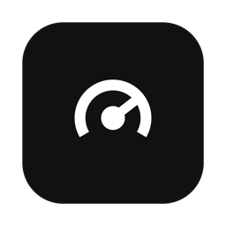

<p align="center">
  
</p>

<h1 align="center">Usage</h1>

<p align="center"><strong>One menu-bar gauge for every AI subscription and API key.</strong></p>

<p align="center">
  
  
  
  
</p>

Usage is a small Mac menu-bar app that shows how much of each AI plan you
have used, all on one scale. It reads Claude Code, Codex and Antigravity
subscription windows and DeepSeek, Moonshot and Soniox API key balances, and
draws each one as percent used. It exists so you can see which limit is
tight, and when it resets, without opening a browser tab per provider.

> **Free and open source.** Usage is free to use, change and share under the MIT License.
> No account, no subscription, no telemetry. The only network calls go to each provider's own usage or balance endpoint, with the credential that provider's tool already keeps.

## Features

- **One axis.** Every meter is percent used. A rate window reports it
  directly. A prepaid balance reports spend since the highest balance seen in
  the last 30 days, so a top-up resets the bar the way a weekly reset does. A
  Claude session at 42 %, a Codex week at 63 %, and a DeepSeek key 24 % down
  from its peak sit in one column of bars.
- **Six sources**, each read on every poll:

  | Row | Lane | What it reads |
  | --- | --- | --- |
  | Claude Code | Subscription | The Claude Code OAuth token in the login keychain, then `api.anthropic.com/api/oauth/usage`: session (5 h), weekly, and the model-scoped weekly windows |
  | Codex | Subscription | `~/.codex/auth.json`, then `chatgpt.com/backend-api/wham/usage`: the primary and secondary rate windows and any per-feature cap |
  | Antigravity | Subscription | `agy --output-format json --print=/usage`: every bucket, as percent used |
  | DeepSeek | API key | `~/.config/deepseek/api_key`, then `api.deepseek.com/user/balance` |
  | Moonshot | API key | `~/.config/moonshot/api_key`, then `api.moonshot.cn/v1/users/me/balance` |
  | Soniox | API key | `~/.config/soniox/api_key` or `SONIOX_API_KEY`, then `api.soniox.com/v1/usage/summary`: spend over the last 30 days (Soniox has no balance endpoint) |

- **A panel, not a menu.** 300 px of glass: a status line ("6 sources ·
  refreshed 2 min ago"), then SUBSCRIPTIONS and API KEYS. Each provider is a
  two-line row (name over lane, plan or balance on the right) with its meter
  rows below: window name, a thin bar, the number, and a footnote naming the
  soonest reset. A provider with more than four windows shows the fullest four
  and says how many it folded.
- **Honest errors.** A source that could not be read says why in its own row,
  in red: "Sign in to Codex", "timeout", "HTTP 404". A number Usage did not get
  back is never drawn. A source you do not use ("No DeepSeek key", "agy not
  installed") is left off the panel.
- **Instant open.** The panel draws the last good numbers at once and, when
  they are older than one poll interval, reads again behind the panel.
- **Status item.** The gauge, as a template image, with one subscription's
  session percent beside it (Settings › Menu bar; Claude by default, or none).
- **Two diagnostics** that open no window: `--doctor` and `--render-proof`.

## Requirements

- macOS 14 or later, Apple Silicon.
- Xcode 15.3 or later (or the matching Swift 5.10 command-line tools) to build.
- Whichever of the six sources you use, signed in through its own tool:
  Claude Code, the Codex CLI, the `agy` CLI for Antigravity, or an API key
  for DeepSeek, Moonshot or Soniox. You do not need all six.

## Install

There is no prebuilt download yet. Build and install from source:

```sh
git clone https://github.com/tristan-mcinnis/usage-menubar.git
cd usage-menubar
./scripts/install.sh --launch      # build, copy to /Applications, add a login item, open it
```

`install.sh` does not launch the app unless you pass `--launch`, because a
launch puts an item in the menu bar and takes focus. Without `--launch` it
installs and registers the login item only.

On first launch macOS asks whether Usage may read the "Claude Code-credentials"
keychain item. Choose Always Allow, or the Claude row stays at "Sign in".

To build under your own bundle ID, change `CFBundleIdentifier` in
`Resources/Info.plist` before you build. The install scripts read it from
there. The default is the author's own `com.tristan.usage-menubar`.

## Usage

Click the gauge in the menu bar to open the panel.

| Key | Action |
| --- | --- |
| Up / Down | Move the selection |
| Return | Open the selected provider's own usage page |
| ⌘R | Refresh now |
| Escape | Close the panel (it also closes when it loses focus) |

The status dot is the only colour: green when every source read, red when
any did not, dim before the first read.

Reads happen on a timer (every five minutes by default, set in Settings), on
⌘R, on a stale open, and after the Mac wakes. A panel nobody opens for two
hours polls every ten minutes instead of every five. A wake read waits up to
30 s for the network. A source that answers HTTP 429 is skipped until its
retry deadline, and its last good numbers stay visible with their age.

Claude Code's OAuth token lasts about eight hours, and Claude Code renews it
when it runs. After a long idle stretch the Claude row says "Token expired"
and keeps its last numbers, marked stale, until Claude Code runs again. Usage
never renews the token itself, because a renewal rotates the refresh token
Claude Code keeps.

Diagnostics, neither of which puts a window on screen. The `usage-bar`
binary is inside the app (`/Applications/Usage.app/Contents/MacOS/usage-bar`),
or run it from a checkout with `swift run usage-bar`:

```sh
usage-bar --doctor                 # every source, read once and printed; secrets show as present or absent
usage-bar --render-proof <dir>     # every panel and settings surface, as PNGs
```

`--doctor` names a source with no tool or key as NOT SET UP and still exits
0 when every source that is set up read.

## Privacy

**What Usage reads.** Each source's credential, from where that provider's
own tool keeps it: the Claude Code item in the login keychain,
`~/.codex/auth.json`, and the DeepSeek, Moonshot and Soniox keys. A plain API
key is looked for in its key file, then by name in `~/.config/secrets.env`
(an optional `NAME=value` file), then in the environment, then in a keychain
item with the variable's name (`DEEPSEEK_API_KEY`, `MOONSHOT_API_KEY`,
`SONIOX_API_KEY`). The key is held in memory for one request and never
written.

**What Usage sends, and where.** Exactly five hosts, one per remote source,
each the provider's own usage or balance endpoint: `api.anthropic.com`,
`chatgpt.com`, `api.deepseek.com`, `api.moonshot.cn` (or `MOONSHOT_BASE_URL`),
and `api.soniox.com`. Antigravity is read through the local `agy` CLI.
There is no telemetry, no crash reporting, no update check, and no other host.

**Unofficial endpoints.** The Claude Code and Codex rows read usage endpoints
that Anthropic and OpenAI do not document for public use. Usage calls them with
the credentials Claude Code and Codex already store on your Mac. These
endpoints may change or stop working at any time, and a row can break until
Usage is updated. Usage never stores those credentials and never sends them
anywhere except to the provider they belong to.

**What Usage stores.** Four files under `~/Library/Application Support/Usage`:
balance samples (`samples.json`, kept 30 days), last-good readings
(`readings.json`), per-provider rate-limit retry deadlines (`retries.json`),
and one line per launch and quit (`events.log`). They hold amounts, plan
names, dates and process IDs, never a credential or a token. `UserDefaults`
holds the appearance, the poll interval, and which provider the status item
shows. See also [PRIVACY.md](PRIVACY.md).

## Build from source

```sh
swift build && swift test          # the app, and the parsers against fixture payloads
bash scripts/test-install.sh       # the installer, against temp fixtures; touches no real install
sh tests/scrub.sh                  # no personal paths or key material in tracked files
./scripts/build-app.sh             # dist/Usage.app, signed
```

`build-app.sh` signs with the first "Apple Development" identity in your
login keychain, or ad hoc when there is none. Force ad hoc with
`SIGN_IDENTITY=- ./scripts/build-app.sh`. The build is not notarized.

The code is two targets. `UsageBarCore` is pure: the meter model, one parser
per source, the credential readers, the HTTP call, and the sample store, with
no AppKit and no timer. `UsageBar` is the app: the panel, the polling, and
the status item. Adding a source is one case on `ProviderID`, one parser in
`Parsers.swift` with a fixture and a test, and one function in
`ProviderReader`.

### Install safety

Every install verifies the candidate (codesign, plist ID, executable, icon,
LSUIElement) before touching the installed app. It renames the previous app
aside rather than deleting it, and keeps an immutable snapshot (with its hash
and signing provenance) so a bad build can be taken back:

```sh
./scripts/install.sh --no-build --rollback   # back to the last good build
./scripts/install.sh --list-backups          # what snapshots are kept
./scripts/install.sh --help                  # every flag
```

A properly signed installed app is never silently replaced with a different
signing identity. That install is refused and the destination is left
untouched; pass `--allow-signing-change` only to override on purpose.

Exit codes: `0` installed, `1` failed (nothing changed, or the prior app was
restored), `3` the app was installed but the login item could not be
registered (no rollback happened; fix the login item and re-run).

If another install holds the lock, or a stale lock is left behind,
`install.sh` refuses instead of stealing it. Clear a stale lock with
`rm -rf <lock dir>` and retry. Backup snapshots are never pruned
automatically; move or clear the backup root yourself.

### Design

The look is the House design system (Slate). `Sources/UsageBar/HouseDesign.swift`
is a generated token file and `Sources/UsageBar/HouseUI.swift` is the shared
component kit, copied in so this repo builds on its own. Do not hand-edit
`HouseDesign.swift`.

## Part of House

Usage is one of a small family of free, local-first Mac tools that share one design system.

| App | What it does |
|---|---|
| [Quick Launch](https://github.com/tristan-mcinnis/quick-launch) | Keyboard-first launcher and instant AI overlay. |
| [Local Dictation](https://github.com/tristan-mcinnis/local-dictation) | Hold a key, talk, and on-device text lands at your cursor. |
| [Local TTS](https://github.com/tristan-mcinnis/local-tts) | Fast on-device voice cloning and text-to-speech. |
| [Local Models](https://github.com/tristan-mcinnis/local-models) | One local daemon that serves a fleet of small models to every app. |
| **[Usage](https://github.com/tristan-mcinnis/usage-menubar)** | One menu-bar gauge for every AI subscription and API key. |

## Credits

Usage has no third-party code or dependencies. The panel, settings shell and
component kit are part of the House design system, shared with the other
House apps. The endpoint shapes for each provider were checked against the
provider extensions of Baby Menu, another usage menu-bar app; no code was
copied. Claude Code, Codex, Antigravity, DeepSeek, Moonshot and Soniox are
named only to label their rows. Full details are in
[THIRD_PARTY_NOTICES.md](THIRD_PARTY_NOTICES.md).

## License

MIT. See [LICENSE](LICENSE). Copyright (c) 2026 Tristan McInnis.
